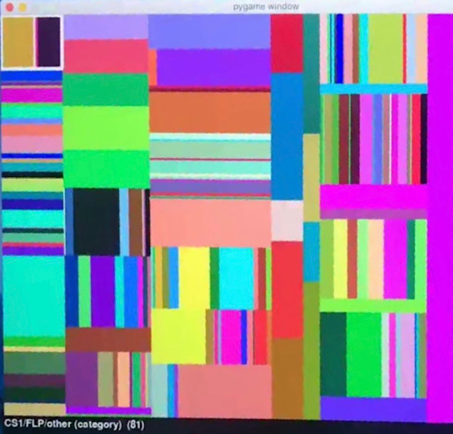

# Treemap Visualizer
 
 
This repo contains an interactive GUI that visualizes hierarchical data on your operating system (computer files and folders) using the treemap algorithm.

A treemap is a visualization technique that shows a tree's structure according to the sizes of its data values. It uses rectangles to show subtrees, scaled to reflect the proportional sizes of each piece of data. The use of tree data structures helps model the hierarchical categorization of a base set of data, where the leaves represent the data values themselves, and internal nodes represent groupings of this data.

In the example I have used, the treemap tool allows you to visualize two different kinds of data: the files and folders in your computer, and a categorization of Computer Science Education research papers. The colours of the rectangles are randomly-generated independently for each node.

Basic Features: 

   - User can expand or collapse folders in the visualizer 
   - User can navigate back up a level to see files collapsed back into a single folder
   - Double-clicking on a rectangle will expand it
   - Left-clicking on a rectangle will display its information along the bottom of the rendered window:
        - The names on the path from the root of the data tree to the selected leaf
        - The selected leaf's data_size
   - Clicking on the same rectangle again unselects it
   - User can close the window and quit the program by clicking the 'X' icon
   
   
Additional Features:

   - User can MUTATE the data tree, without it changing the original data, by pressing the 'Up Arrow' or 'Down Arrow' key on a selected rectangle (±1%)
   - If the user selects a rectangle that is a leaf in the whole tree, then hovers the cursor over another rectangle that is an internal node in the whole tree and presses 'm',      the selected leaf should be moved to be a subtree of the internal node being hovered over
   - If the user selects a rectangle, and then presses 'e', the tree corresponding to that rectangle is expanded in the displayed-tree
   - If the user selects a rectangle, and then presses 'c', the parent of that tree is unexpanded (or "collapsed") in the displayed-tree. (Note that since rectangles correspond      to leaves in the displayed-tree, it is the parent that needs to be unexpanded.)
   - If the user selects a rectangle, and then presses 'a', the tree corresponding to that rectangle, as well as all of its subtrees, are expanded in the displayed-tree
   - If the user selects any rectangle, and then presses 'x', the entire displayed-tree is collapsed down to just a single tree node
   
   
### *Launch using the visualizer.py file.
